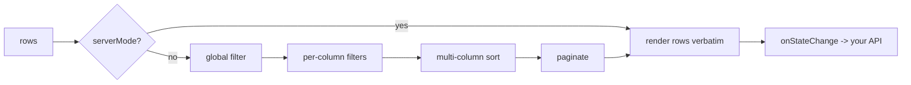

<div align="center">


# react-data-table

### The fast, strict-typed, fully-accessible data table for React.

Multi-column sort, global + per-column filters, row selection, column
visibility, CSV export, custom renderers, and server-side hooks — in a single
zero-dependency component.

**Built and maintained by [Viprasol Tech](https://viprasol.com).**

[](https://www.npmjs.com/package/react-data-table)
[](LICENSE)
[](tsconfig.json)
[](https://react.dev)
[](src/__tests__)
[](https://github.com/Viprasol-Tech/react-data-table/actions)
[](CONTRIBUTING.md)

</div>

---

## Features

- 🔀 **Multi-column sort** — click headers to build an Excel-style sort chain with priority badges.
- 🔎 **Global + per-column filters** — fuzzy substring search across all columns, plus opt-in per-column inputs (AND logic).
- ☑️ **Row selection** — checkbox column, tri-state select-all (indeterminate), controlled or uncontrolled.
- 👁️ **Column visibility** — a runtime show/hide menu, seeded by a per-column `hidden` flag.
- 📤 **CSV export** — one-click RFC-4180 export of the filtered + sorted data.
- 🎨 **Custom cell renderers** — render badges, links, formatted dates — anything `ReactNode`.
- 🛰️ **Server-mode hooks** — delegate sort/filter/pagination to your backend via `onStateChange`.
- 📄 **Pagination** — prev/next, page info, and a configurable page-size selector.
- ♿ **Accessible** — `aria-sort`, `aria-selected`, labelled controls, full keyboard operation.
- 🧮 **Pure, tested logic** — every transform is a side-effect-free helper you can import standalone.
- 🟦 **Strict TypeScript** — generic over your row type; zero `any`.
- 🪶 **Zero runtime dependencies** — just React as a peer.

## Install

```bash
npm install react-data-table
# or
pnpm add react-data-table
# or
yarn add react-data-table
```

> Requires React 18+ (declared as a peer dependency).

## Usage

```tsx
import { DataTable, type Column } from "react-data-table";

interface User {
  id: number;
  name: string;
  email: string;
  role: "admin" | "user";
  joined: string;
}

const columns: Column<User>[] = [
  { key: "name", header: "Name", filterable: true },
  { key: "email", header: "Email" },
  {
    key: "role",
    header: "Role",
    render: (value) => (
      <span className={`badge badge--${value}`}>{String(value)}</span>
    ),
  },
  { key: "joined", header: "Joined", sortable: true },
];

const users: User[] = [
  { id: 1, name: "Ada Lovelace", email: "ada@viprasol.com", role: "admin", joined: "2021-03-04" },
  { id: 2, name: "Alan Turing", email: "alan@viprasol.com", role: "user", joined: "2022-07-12" },
  // ...
];

export function People() {
  return (
    <DataTable
      columns={columns}
      rows={users}
      pageSize={10}
      selectable
      columnToggle
      exportable
      getRowId={(u) => String(u.id)}
      onSelectionChange={(ids) => console.log("selected:", [...ids])}
    />
  );
}
```

### Server-side data

```tsx
<DataTable
  columns={columns}
  rows={pageRows}          // only the current page from your API
  serverMode
  totalRows={totalCount}   // total matching rows on the server
  loading={isFetching}
  onStateChange={(state) => {
    // state.sort, state.query, state.columnFilters, state.page, state.pageSize
    fetchFromApi(state);
  }}
/>
```

### Using the pure helpers directly

```ts
import { sortRowsMulti, filterRowsByColumn, toCsv } from "react-data-table";

const sorted = sortRowsMulti(rows, [
  { key: "age", dir: "asc" },
  { key: "name", dir: "asc" },
]);
const csv = toCsv(sorted, [{ key: "name", header: "Name" }, { key: "age" }]);
```

## How it works



In client mode the pipeline is **global filter → per-column filters → multi-sort → paginate**.
In server mode the component renders `rows` as-is and emits a `TableState` whenever the user changes sort, filter, page, or page size.

## Props / API

### `<DataTable<T> />`

| Prop | Type | Default | Description |
| --- | --- | --- | --- |
| `columns` | `Column<T>[]` | — | Column definitions, in display order. |
| `rows` | `T[]` | — | Row data. In server mode, just the current page. |
| `pageSize` | `number` | `10` | Initial rows per page. |
| `pageSizeOptions` | `number[]` | `[10,25,50,100]` | Options in the page-size selector. `[]` hides it. |
| `filterable` | `boolean` | `true` | Show the global text filter. |
| `filterPlaceholder` | `string` | `"Filter..."` | Placeholder for the global filter. |
| `columnToggle` | `boolean` | `false` | Show the column visibility menu. |
| `exportable` | `boolean` | `false` | Show the "Export CSV" button. |
| `exportFileName` | `string` | `"table.csv"` | File name for the CSV download. |
| `selectable` | `boolean` | `false` | Enable row selection checkboxes. |
| `getRowId` | `(row, i) => string` | index | Stable row identity for selection. |
| `selectedIds` | `Set<string>` | — | Controlled selection set. |
| `onSelectionChange` | `(ids: Set<string>) => void` | — | Fires with the next selection. |
| `serverMode` | `boolean` | `false` | Delegate transforms to the host. |
| `totalRows` | `number` | `rows.length` | Total rows (for page count in server mode). |
| `onStateChange` | `(state: TableState<T>) => void` | — | Fires on sort/filter/page changes. |
| `loading` | `boolean` | `false` | Render an in-table loading row. |
| `emptyMessage` | `ReactNode` | `"No data"` | Shown when no rows match. |
| `className` | `string` | — | Class on the wrapping element. |

### `Column<T>`

| Field | Type | Default | Description |
| --- | --- | --- | --- |
| `key` | `keyof T & string` | — | Row property this column reads. |
| `header` | `string` | `key` | Header label. |
| `sortable` | `boolean` | `true` | Whether the column is sortable. |
| `filterable` | `boolean` | `false` | Give the column its own filter input. |
| `filterPlaceholder` | `string` | `"Filter"` | Placeholder for that input. |
| `hidden` | `boolean` | `false` | Hide initially (toggleable). |
| `render` | `(value, row, i) => ReactNode` | stringify | Custom cell renderer. |
| `toCsv` | `(value, row) => string` | raw value | Custom CSV serializer. |

### Exported helpers

`sortRows` · `sortRowsMulti` · `toggleSortSpec` · `paginate` · `pageCount` · `clampPage` · `filterRows` · `filterRowsByColumn` · `compareValues` · `nextSortDirection` · `toCsv` · `escapeCsvValue` · `resolveRowId` · `toggleSelection` · `selectionState` · `setAllSelected`

Types: `Row` · `SortDirection` · `SortSpec` · `ColumnFilters` · `CsvOptions` · `Column` · `DataTableProps` · `TableState`

## Roadmap

- [x] Multi-column sort
- [x] Global + per-column filters
- [x] Row selection with tri-state select-all
- [x] Column visibility toggle
- [x] CSV export
- [x] Server-mode hooks
- [ ] Sticky header & virtualized rows for very large datasets
- [ ] Column resizing & reordering (drag & drop)
- [ ] Expandable / nested rows
- [ ] Built-in theming presets

## FAQ

**Does it ship any styles?**
No — it renders semantic, class-tagged markup (`rdt-*` classes) so you can style it freely. It's headless-friendly.

**Can I use the sorting/filtering logic without the component?**
Yes. Every transform (`sortRowsMulti`, `filterRowsByColumn`, `toCsv`, …) is a pure, exported function with no React dependency.

**Is selection controlled or uncontrolled?**
Both. Omit `selectedIds` for internal state, or pass `selectedIds` + `onSelectionChange` to control it yourself.

**How big is it?**
Tiny — zero runtime dependencies beyond React, which is a peer.

## Contributing

Contributions are welcome! Please read [CONTRIBUTING.md](CONTRIBUTING.md) and our
[Code of Conduct](CODE_OF_CONDUCT.md). To get started:

```bash
git clone https://github.com/Viprasol-Tech/react-data-table.git
cd react-data-table
npm install
npm run typecheck
npm test
```

## Contact — Viprasol Tech Private Limited

- Website: [viprasol.com](https://viprasol.com)
- Email: [support@viprasol.com](mailto:support@viprasol.com)
- Telegram: [t.me/viprasol_help](https://t.me/viprasol_help) | WhatsApp: +91 96336 52112
- GitHub: [@Viprasol-Tech](https://github.com/Viprasol-Tech) | [LinkedIn](https://www.linkedin.com/in/viprasol/) | X [@viprasol](https://twitter.com/viprasol)

## License

[MIT](LICENSE) (c) 2025 Viprasol Tech Private Limited
